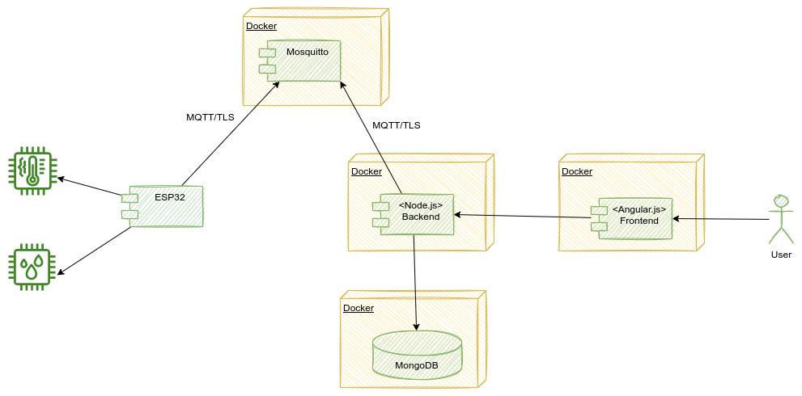
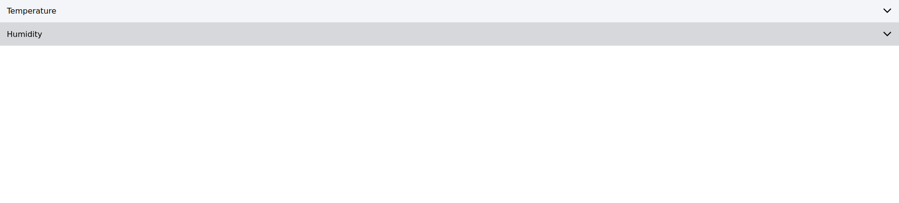
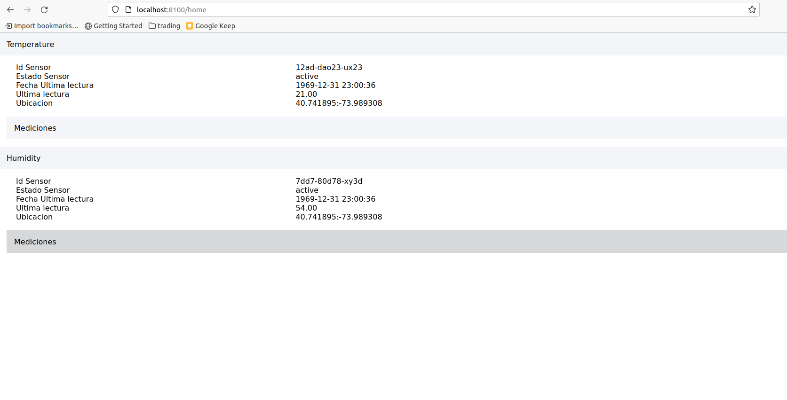
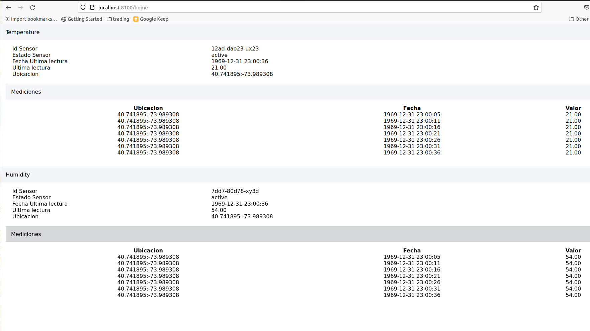

# Universidad de Buenos Aires - Especializacion en Internet de las Cosas
## Asignatura Desarrollo de Aplicaciones para IoT
## Trabajo Practico integrador
### Alumno Gonzalo Carreno
========================================


Pasos para ejecutar el proyecto

0) Generar los correspondientes certificados con el script docs/crea_certs2.sh para el servidor Mosquitto e instalarlos en los clientes: ESP32 y el backend Node.js. Tener en cuenta de reemplazar las variables P1 por la IP del host donde se levantaran los servicios y P2 con el nombre del container asignado a Mosquitto (debido a que el servicio de Node.js accedera mediante dicho nombre de dominio en lugar de la IP del host).
1) Ejecutar el comando npm install dentro de los directorios processing_layer/src/frontend y processing_layer/src/backend 
2) Levantar el proyecto mediante docker-compose up en el directorio processing_layer. Esto debería crear los contenedores de la capa de procesamiento para los servicios de Mosquitto, Node y el frontend en Angular.
3) Ejecutar el comando docker-compose up en el directorio fetching_layer con el ESP_32 conectado al sensor DHT11.
4) Acceder al frontend en http://localhost:8100 y a la API rest mediante http://localhost:8000/api/devices3.


Notas del diseño del sistema:
=========================================



Componentes:
- Mosquitto
- ESP32 utilizando un sensor DHT11 para medir temperatura y humedad, conectado al ESP32 mediante el pin GPIO 18
- Node.js utilizando las librerias MQTT.js, Express y Cors.
- Frontend Ionic/Angular desarrollado en Typescript.
- MongoDB como base de datos NoSQL para almacenamiento de los datos enviados. 


APIs provistas en Express:
- GET /api/devices3/

Estructura de datos utilizada en MongoDB:
```
{
    "_id": "string",
    "deviceId": "string",
    "deviceDescription": "string",
    "lastMeasureValue": "string",
    "lastMeasureLocation": "string",
    "lastMeasureTime": "string",
    "status": "string",
    "measures": [
        {
            "deviceId": "string",
            "type": "string",
            "value": "string",
            "location": "string",
            "time": "string"
        } ...
      
    ]
}


```

Algunas capturas de pantalla del producto terminado:
===================================================

Accediendo al home del proyecto en http://localhost:8100


Luego al navegar los distintos dispositivos podemos apreciar la información de cada uno, su estado y los botones disponibles para renderizar la última lectura y abrirla electroválvula. Notas que igualmente al desplegar el sensor el valor de su última lectura se renderiza en el componente gráfico automáticamente.


Luego podemos explorar las diferentes mediciones y riegos disponibles para cada sensor. En caso de no contar con ninguno se oculta el menú accordion.


